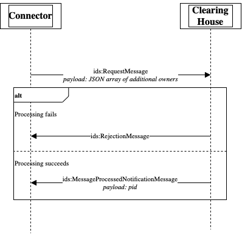

# Communication Proposal

Es gibt zwei Wege um eine Transaktion im Clearinghouse zu loggen

## 1. Aktuelle Implementierung (Connector)
Der Endpunkt ```POST /messages/log/:PID``` wird mit einer zufällig generierten PID aufgerufen. Das hat einige Nachteile:
- Es wird für jede Transaktion ein neuer Prozess angelegt.
- Transaktionen können nicht gruppiert (einem Vertrag zugeordnet) werden.
- Transaktionen von anderen Connectoren können nicht zur gleichen Transaktion gefiltert werden.

## 2. Optimierter Ansatz
Bevor eine Transaktion stattfindet, wird ein Vertrag geschlossen. In diesem Schritt könnte der Prozess im Clearinghouse bereits angelegt werden. Hierbei ist es auch möglich, mehrere Connector IDs anzugeben, um festzulegen, wer Lese- und Schreibrechte besitzt.
- Die erstellte PID muss mit allen Connectoren geteilt werden.
- Die Connectoren können auf die gleiche PID loggen, um die Transaktionen nach Verträgen zu gruppieren.
- Der MDS kann seinen eigenen Connector als Standard festlegen, um Zugriff auf alle Transaktionen zu erhalten.

## Ablauf
### CreateLogMessage


### CreatePID
